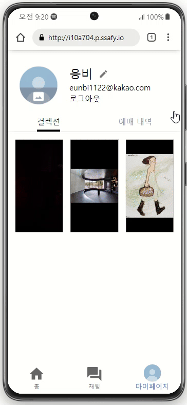

# Aːticket


A:Ticket: 숏폼 기반 공연·전시 추천·예매 플랫폼
> http://i10a704.p.ssafy.io/

## 진행 기간
2023.12.28 ~ 2024.02.16

## 팀원 소개
SSAFY 10기 공통 프로젝트 A704

| 팀장<br>이건희 | 팀원<br>강지헌 | 팀원<br>박이언 | 팀원<br>유지웅 | 팀원<br>최은비 | 팀원<br>최지원 |
|:---:|:---:|:---:|:---:|:---:|:---:|
| FE/BE <br> 예매/결제 | BE/Infra <br> 로그인 로직, CI/CD | BE <br> 추천 알고리즘 서버 | FE/BE <br> 로그인, 세부 정보 화면 | FE <br> 숏폼, 마이페이지 화면 | FE/BE <br> 채팅 |

## 프로젝트 소개
전시 공연을 좋아하는 6명의 팀원이 뭉쳤다!

`"내 취향에 맞는 전시, 공연을 찾는게 너무 힘들어..."`

우리의 공통 관심사에서 파생된 어려움을 극복하기 위해 이번 프로젝트를 기획했습니다.

## 주요 기능
### 숏폼 (Short Form)

- 전시/공연 숏폼 시청
- 숏품을 위아래로 슬라이드하여 이동
- CF 알고리즘을 적용하여 사용자 맞춤 추천

### 채팅 (Chat)


- 전시, 연극, 뮤지컬 카테고리 별 채팅방
- 다른 이용자와 실시간 소통

### 예약 (Book)



- 날짜, 좌석 등 예매 정보 선택
- 카카오페이 결제
- 자신의 예매 내역 확인

### 컬랙션 (Collection)

- 마음에 드는 숏폼을 저장할 수 있음
- 마이페이지에서 자신만의 컬렉션 확인 가능

## 프로젝트 구조도


## 주요 기술
### Backend - 메인
- Spring Boot 3.2.1
- Spring Data JPA
- Spring Security
- Spring Web
- Spring Cloud AWS
- Swagger 3
- MySQL
- WebSocket
- Jwt

### Backend - 추천
- Flask
- PySpark
- MySQL

### Backend - 벤더
- Spring Boot 3.2.1
- MyBatis
- MySQL

### Frontend
- React
- MUI
- Tailwind
- axios
- SockJS
- STOMP
- React Router DOM
- SweetAlert 2
- Vite

### 배포
- AWS Lightsail
- AWS S3
- AWS RDS
- Nginx
- Jenkins
- Docker

## 프로젝트 파일 구조
### Backend - 메인
```
server
  ├─art
  │  ├─controller
  │  ├─data
  │  ├─domain
  │  ├─repository
  │  └─service
  ├─billing
  │  └─...
  ├─chat
  │  └─...
  ├─common
  │  ├─config
  │  ├─entity
  │  ├─exception
  │  ├─jwt
  │  ├─response
  │  └─util
  ├─like
  │  └─...
  ├─login
  │  └─...
  ├─shorts
  │  └─...
  ├─timetable
  │  └─...
  └─user
     └─...
```

### Backend - 추천
```
recommend
  ├─data
  ├─db
  └─service
```


## Backend - 벤더
```
vendor
  ├─art
  │  ├─domain
  │  └─repository
  ├─billing
  │  ├─controller
  │  ├─data
  │  ├─domain
  │  ├─repository
  │  └─service
  ├─common
  ├─seat
  │  └─...
  ├─tickettype
  │  └─...
  └─timetable
     └─...

```

## 문서 (Documentation)
- [프로젝트 노션](https://instinctive-talk-7a7.notion.site/Aticket-637a6f1875244119a8c89f14ed540b44?pvs=4)
- [메인서버 API 명세서](https://instinctive-talk-7a7.notion.site/API-0123398122db48e6ad3e735f07a752ea)
- [벤더서버 API 명세서](https://instinctive-talk-7a7.notion.site/API-91f9f1b051804354b61c55cf7f994712)
### 프로젝트 결산 노션 페이지
- [4주차 결산 페이지](https://instinctive-talk-7a7.notion.site/8a1c64ca57fd45ff837a4aef4ae53faf?pvs=4)


